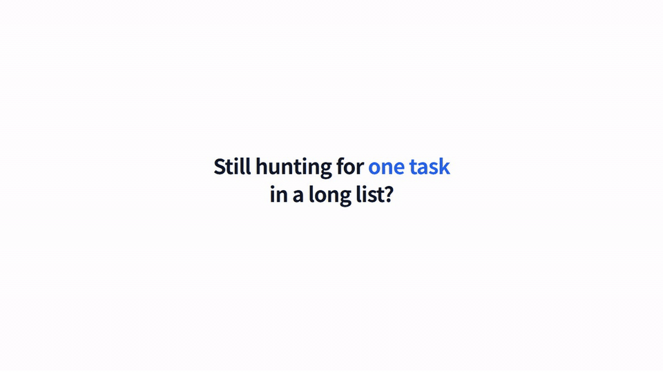

# web-demo-video

[English](README.md)

실제 웹 서비스 화면으로 제품 영상을 만드는 Claude Code 스킬과 도구 모음입니다.

- **사용 설명 영상 (워크스루)**: 실제 화면을 조작하는 모습을 녹화하고 자막, 부드럽게 움직이는 커서, 클릭 표시, 강조 테두리를 얹습니다. 기능 사용법이나 고객 문의 답변용입니다.
- **소개 영상 (모션그래픽)**: 고화질 화면 캡처 위에서 카메라 이동, 화면 사이를 오가는 표시, 올라가는 숫자를 코드로 움직입니다. 출시 소개나 홈페이지용입니다.

기본 출력은 2560×1440, 30fps, H.264입니다.

| 사용 설명 영상 (26초) | 소개 영상 (20초) |
|---|---|
|  |  |

미리보기는 화질을 줄인 GIF입니다. 원본 화질 MP4는 [v0.1.0 릴리스](https://github.com/soloandco/web-demo-video/releases/tag/v0.1.0)에 있습니다. 두 영상 모두 이 저장소의 예시 앱으로 만들었습니다.

코드보다 중요한 작업 규칙도 스킬에 들어 있습니다. 목적에 따라 방식을 고르기, 렌더링 전에 스토리보드 합의하기, 새 화면은 전체를 먼저 보여 준 뒤 확대하기, 장면마다 움직임 바꾸기, 실제 사용자 질문에서 자막 뽑기, 넘기기 전에 프레임 모음으로 점검하기, 화면에 실제 고객 데이터를 넣지 않기입니다.

## 설치

Claude Code에서:

```
/plugin marketplace add soloandco/web-demo-video
/plugin install web-demo-video@web-demo-video
```

그다음 영상을 요청합니다. 예: *"우리 앱의 송장 내보내기 기능을 30초 사용 설명 영상으로 만들어 줘"*. Claude가 방식을 고르고, 스토리보드 초안으로 확인을 받고, 도구를 프로젝트에 복사해 영상을 만듭니다.

필요한 것: Node 20 이상, Google Chrome, ffmpeg.

## 예시 실행

저장소에 가상의 할 일 관리 앱과, 두 방식으로 영상을 한 편씩 만드는 스크립트가 들어 있습니다.

```bash
git clone https://github.com/soloandco/web-demo-video
cd web-demo-video
npm install

npm run example:record      # out/sample-tasks-walkthrough.mp4 (녹화 약 30초)
npm run example:capture     # 소개 영상용 화면 캡처
npm run example:render -- --browser-executable="<크롬 경로>"   # out/sample-tasks-motion.mp4 (몇 분)
```

크롬이 기본 위치에 없으면 `CHROME_PATH`를 지정합니다. Remotion 렌더는 `--browser-executable`을 줘야 브라우저를 따로 내려받지 않고 설치된 크롬을 씁니다.

## 참고

- 예시에 나오는 이름과 데이터는 모두 가상입니다.
- 내레이션 도구는 들어 있지 않습니다. 추천: Gemini 3.1 Flash TTS(`gemini-3.1-flash-tts-preview`)의 **Charon** 목소리.
- 문서가 입력칸으로 날아가는 것 같은 연출은 설명을 위한 그림입니다. 영상을 공개할 때 자막은 제품이 실제로 하는 일만 말하게 하세요.
- 소개 영상 방식은 Remotion을 씁니다. Remotion은 개인, 비영리 단체, 직원 3명 이하 영리 회사는 무료이고 그보다 큰 회사는 별도 회사 라이선스가 필요합니다. [remotion.dev/license](https://www.remotion.dev/license)를 확인하세요. 사용 설명 영상 방식은 Remotion을 쓰지 않습니다.

## 라이선스

MIT
